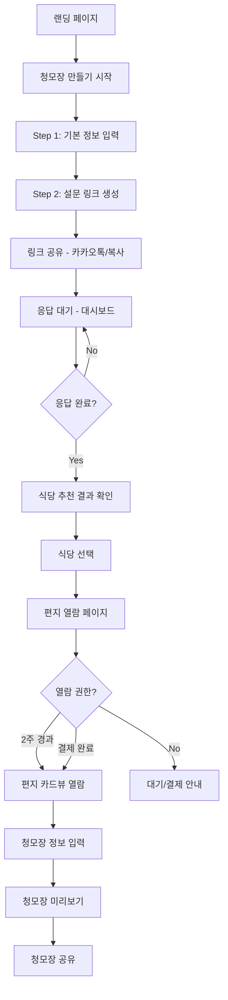
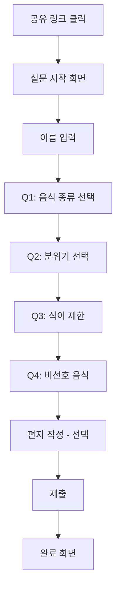

# 청모장 UX Design Specification

_Created on 2025-11-22 by BMad_
_Generated using BMad Method - Create UX Design Workflow v1.0_

---

## Executive Summary

**프로젝트:** 청모장 - 청첩장 모임 준비 올인원 서비스

**비전:** 바쁜 예비 신부의 청첩장 모임 준비 부담을 덜고, 평범한 모임을 소중한 추억으로 만들어주는 서비스

**타겟 사용자:**
- **Host (예비 신부):** 결혼 준비로 바쁜 와중에 여러 그룹의 청모를 준비해야 하는 사람
- **Guest (참석자):** 친구의 결혼을 축하하며 모임에 참여하는 사람

**핵심 가치:**
1. URL 하나로 친구들 취향 수집 → AI 식당 추천
2. 축하 편지를 모아 단순 모임을 추억으로 전환
3. Host의 준비 부담 최소화

**플랫폼:** 모바일 first 반응형 웹

**UX 복잡도:** 중간
- 2개 사용자 역할 (Host, Guest)
- 6개 핵심 사용자 여정
- 실시간 기능 필요 (응답 현황)

---

## 1. Design System Foundation

### 1.1 Design System Choice

**선택:** Tailwind CSS + Custom Components (레퍼런스 UI 기반)

**근거:**
- 레퍼런스 UI가 이미 Tailwind CSS로 구현됨
- 웨딩 테마에 맞는 커스텀 스타일 필요
- shadcn/ui 컴포넌트 활용 가능

**제공되는 것:**
- Tailwind 유틸리티 클래스
- 반응형 브레이크포인트
- 커스텀 컬러 테마

**커스텀 필요:**
- 웨딩 테마 컬러 팔레트
- 카드 컴포넌트 (설문 옵션, 편지 카드)
- 프로그레스 바 (단계 표시)
- 이모지/스티커 선택기

---

## 2. Core User Experience

### 2.1 Defining Experience

**한 문장 정의:**
> "URL 하나 공유하면 친구들 취향을 모아 완벽한 식당을 찾아주고, 축하 편지까지 모아주는 서비스"

**핵심 경험 원칙:**

| 원칙 | 설명 |
|------|------|
| **Speed** | 설문 3분 이내 완료, 모든 페이지 2초 내 로딩 |
| **Guidance** | 단계별 프로그레스 바, 친절한 안내 문구 |
| **Flexibility** | 선택 항목은 건너뛰기 가능, 필수만 강조 |
| **Feedback** | 즉각적인 시각적 피드백 (선택 시 색상 변경) |

### 2.2 Novel UX Patterns

**특별한 패턴: 편지 열람 경험**

청모장만의 고유한 경험 - "2주 대기 후 열람" 또는 "결제 후 즉시 열람"

**디자인 포인트:**
- 편지가 도착했음을 알리는 시각적 티저
- 잠긴 상태에서도 기대감 유발 (D-day 카운트다운)
- 열람 순간의 감동 극대화 (카드 스와이프 UI)

---

## 3. Visual Foundation

### 3.1 Color System

**Primary Palette (레퍼런스 기반):**

| 용도 | 색상 | Hex | 사용처 |
|------|------|-----|--------|
| Primary | 핑크 | #FF6B9D | CTA 버튼, 강조, 프로그레스 바 |
| Secondary | 연핑크 | #FFE5EC | 배경, 선택된 상태, 호버 |
| Accent | 보라 | #8B5CF6 | 포인트, 그라데이션 |

**Semantic Colors:**

| 용도 | 색상 | Hex |
|------|------|-----|
| Success | 초록 | #10B981 |
| Warning | 주황 | #F59E0B |
| Error | 빨강 | #EF4444 |
| Info | 파랑 | #3B82F6 |

**Neutral Scale:**

| 용도 | 색상 | Hex |
|------|------|-----|
| Text Primary | 다크그레이 | #1F2937 |
| Text Secondary | 미디엄그레이 | #6B7280 |
| Border | 라이트그레이 | #E5E7EB |
| Background | 화이트/핑크그라데이션 | #FFFFFF / from-pink-50 to-purple-50 |

### 3.2 Typography

**Font Family:** Noto Sans KR

| 레벨 | 크기 | 무게 | 용도 |
|------|------|------|------|
| H1 | 2xl (24px) | Bold (700) | 페이지 타이틀 |
| H2 | lg (18px) | Semibold (600) | 섹션 타이틀 |
| Body | base (16px) | Regular (400) | 본문 |
| Small | sm (14px) | Regular (400) | 보조 텍스트 |
| Tiny | xs (12px) | Medium (500) | 라벨, 배지 |

### 3.3 Spacing System

**Base Unit:** 4px (Tailwind 기본)

| 토큰 | 값 | 용도 |
|------|-----|------|
| xs | 4px (p-1) | 아이콘 간격 |
| sm | 8px (p-2) | 요소 내부 간격 |
| md | 16px (p-4) | 카드 패딩 |
| lg | 24px (p-6) | 섹션 간격 |
| xl | 32px (p-8) | 페이지 상하 여백 |

### 3.4 Border Radius

| 용도 | 값 | 클래스 |
|------|-----|--------|
| 버튼 | 12px | rounded-xl |
| 카드 | 16px | rounded-2xl |
| 인풋 | 12px | rounded-xl |
| 아바타 | 50% | rounded-full |
| 배지 | 9999px | rounded-full |

---

## 4. Design Direction

### 4.1 Chosen Design Approach

**방향:** 따뜻하고 로맨틱한 웨딩 테마 + 모바일 최적화

**레이아웃 원칙:**
- 단일 컬럼 (모바일 first)
- 카드 기반 컨텐츠 구성
- 고정 헤더 + 고정 하단 CTA

**비주얼 스타일:**
- 그라데이션 배경 (pink-50 → purple-50)
- 부드러운 그림자 (shadow-sm)
- 이모지 적극 활용
- 아이콘 + 텍스트 조합

**레퍼런스 UI 핵심 패턴:**

```
┌─────────────────────────┐
│ Header (sticky)         │ ← 뒤로가기 + 타이틀
├─────────────────────────┤
│ Progress Bar            │ ← 단계 표시 (n/5)
├─────────────────────────┤
│                         │
│  Content Cards          │ ← 둥근 카드, 그림자
│  - Icon + Label         │
│  - Selection Grid       │
│                         │
├─────────────────────────┤
│ Bottom CTA (fixed)      │ ← 그라데이션 버튼
└─────────────────────────┘
```

---

## 5. User Journey Flows

### 5.1 Host Journey



### 5.2 Guest Journey



### 5.3 Key Screens (with Reference Mapping)

| 화면 | 레퍼런스 | 상태 |
|------|----------|------|
| 랜딩 페이지 | - | **신규 필요** |
| 청모장 만들기 | create-invitation.html | ✅ 있음 |
| 설문 링크 공유 | - | **신규 필요** |
| 응답 현황 대시보드 | - | **신규 필요** |
| 설문 참여 | form.html | ✅ 있음 |
| 식당 추천 결과 | - | **신규 필요** |
| 편지함 | invitaion-letter-box.html | ✅ 있음 |
| 편지 상세 보기 | - | **신규 필요** |
| 청모장 공유 템플릿 | - | **신규 필요** |
| Admin 페이지 | - | **신규 필요** |

---

## 6. Component Library

### 6.1 Component Strategy

**Tailwind/기본 컴포넌트:**
- Button (primary, secondary, disabled)
- Input (text, textarea)
- Modal

**커스텀 컴포넌트 (레퍼런스 기반):**

#### SelectionCard
- 용도: 설문 옵션 선택 (음식, 분위기 등)
- 상태: default, hover, selected
- 구성: 이모지 + 라벨 + 설명(optional)

#### LetterCard
- 용도: 편지함에서 편지 표시
- 상태: NEW, 대기중, 읽음
- 구성: 프로필, 이름, 미리보기, 상태 배지

#### ProgressBar
- 용도: 단계 진행 표시
- 구성: 현재 단계 / 전체 단계 + 퍼센트

#### StickerPicker
- 용도: 편지에 이모지/스티커 추가
- 구성: 스크롤 가능한 이모지 버튼 목록

#### CountdownBadge
- 용도: D-day 카운트다운 표시
- 구성: 아이콘 + "n일 후 열람 가능"

---

## 7. UX Pattern Decisions

### 7.1 Consistency Rules

#### Button Hierarchy
| 타입 | 스타일 | 용도 |
|------|--------|------|
| Primary | 그라데이션 (primary → accent) | 주요 액션 (다음, 제출) |
| Secondary | 흰 배경 + 테두리 | 보조 액션 (취소, 건너뛰기) |
| Tertiary | 텍스트만 | 링크형 액션 |
| Destructive | 빨간 배경 | 삭제 확인 |

#### Feedback Patterns
| 상황 | 패턴 |
|------|------|
| Success | 모달 (체크 아이콘 + 메시지) |
| Error | 인라인 (빨간 텍스트) |
| Loading | 버튼 내 스피너 |
| Toast | 없음 (모달 사용) |

#### Form Patterns
| 항목 | 결정 |
|------|------|
| Label 위치 | 인풋 위 |
| 필수 표시 | 빨간 배지 "필수" |
| 검증 타이밍 | onSubmit |
| 도움말 | 인풋 하단 회색 텍스트 |

#### Selection Patterns
| 상황 | 패턴 |
|------|------|
| 단일 선택 | 클릭 시 이전 선택 해제 |
| 복수 선택 | 클릭 시 토글 |
| 선택 표시 | border-primary + bg-secondary |

#### Empty States
| 상황 | 패턴 |
|------|------|
| 청모장 없음 | 일러스트 + "첫 청모장을 만들어보세요" + CTA |
| 응답 없음 | 아이콘 + "아직 응답이 없어요" |
| 편지 없음 | 아이콘 + "받은 편지가 없어요" |

---

## 8. Responsive Design & Accessibility

### 8.1 Responsive Strategy

**Breakpoints:**

| 디바이스 | 범위 | 레이아웃 |
|----------|------|----------|
| Mobile | < 640px | 단일 컬럼, 풀 너비 |
| Tablet | 640px - 1024px | 단일 컬럼, 최대 너비 제한 |
| Desktop | > 1024px | 중앙 정렬, 최대 480px 너비 (모바일 UI 유지) |

**모바일 First 원칙:**
- 데스크탑에서도 모바일 레이아웃 유지 (앱 느낌)
- 중앙 정렬로 좌우 여백 처리

### 8.2 Accessibility

**WCAG Level:** AA

**핵심 요구사항:**
- 색상 대비: 4.5:1 이상
- 터치 타겟: 최소 44x44px
- 키보드 네비게이션: 모든 인터랙티브 요소
- Focus 표시: 명확한 포커스 링
- Alt 텍스트: 모든 이미지

---

## 9. Implementation Guidance

### 9.1 신규 필요 화면 설계 방향

#### 1. 랜딩 페이지
- Hero: 서비스 핵심 가치 (이미지 + 텍스트)
- 3-Step 프로세스 설명
- CTA: "청모장 만들기" 버튼
- 푸터: 간단한 서비스 정보

#### 2. 설문 링크 공유 화면
- 생성된 URL 표시
- "링크 복사" 버튼 (클립보드)
- "카카오톡 공유" 버튼
- 공유 완료 후 다음 단계 안내

#### 3. 응답 현황 대시보드
- 총 응답자 수 (큰 숫자)
- 응답자 목록 (이름 + 응답 시간)
- 프로그레스 바 (응답률)
- "설문 마감" 버튼

#### 4. 식당 추천 결과
- Top 3-5 식당 카드 목록
- 각 카드: 이름, 사진, 매칭 점수, 매칭 이유
- "이 식당으로 선택" 버튼

#### 5. 편지 상세 보기
- 전체 화면 카드
- 작성자 이름
- 편지 내용 (300자)
- 스티커/이모지
- 스와이프로 다음 편지

#### 6. 청모장 공유 템플릿
- 웨딩 테마 디자인
- 식당 정보 + 일정
- 지도 링크
- 공유 버튼

### 9.2 Completion Summary

**생성된 아티팩트:**
- ✅ UX Design Specification: docs/ux-design-specification.md

**다음 단계:**
1. 신규 화면 HTML 프로토타입 생성
2. Architecture 워크플로우 진행
3. Epic 스토리 구현

---

## Appendix

### Related Documents
- Product Requirements: `docs/prd.md`
- Epic Breakdown: `docs/epics.md`

### Reference UI Files
- create-invitation.html: 청모장 만들기 화면
- form.html: 설문 참여 화면
- invitaion-letter-box.html: 편지함 화면

### Version History

| Date | Version | Changes | Author |
|------|---------|---------|--------|
| 2025-11-22 | 1.0 | Initial UX Design Specification | BMad |

---

_This UX Design Specification was created based on existing reference UI files and collaborative design facilitation._
